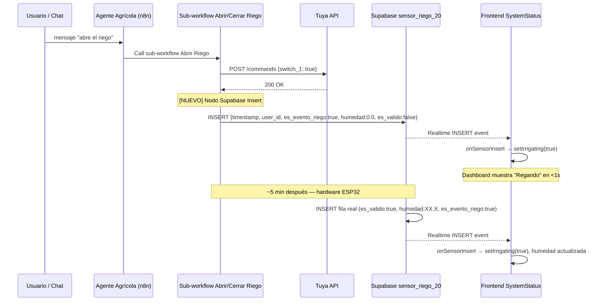
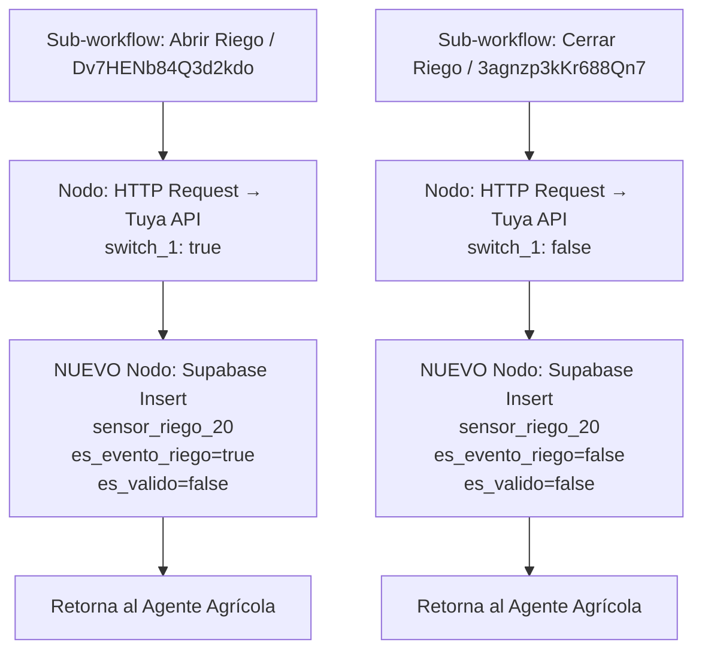

# Design: estado-riego-no-actualiza-tras-agente-chat

## Decisiones Técnicas

### DT-1: Fila sintética en `sensor_riego_20` como señal de estado inmediata

**Contexto**: Los sub-workflows n8n Abrir/Cerrar Riego solo llaman a la API Tuya y no escriben nada en Supabase. El frontend depende de INSERTs en `sensor_riego_20` para actualizar el estado de riego vía Realtime, lo que genera un delay de ~5 min hasta la próxima lectura del hardware.

**Decisión**: Los sub-workflows `Abrir Riego` (`Dv7HENb84Q3d2kdo`) y `Cerrar Riego` (`3agnzp3kKr688Qn7`) insertarán una fila sintética en `sensor_riego_20` inmediatamente tras la acción Tuya, marcada con `es_valido = false`.

**Justificación**: Es el cambio de menor superficie (2 nodos nuevos en n8n) que resuelve directamente la causa raíz. No requiere migración de schema, no requiere cambio en el frontend. El frontend ya tiene toda la lógica necesaria para manejar correctamente la fila: la suscripción Realtime actualiza el estado visible, y el filtro `es_valido === false` impide que la fila contamine gráficos y períodos de riego.

**Alternativas descartadas**:
- Tabla dedicada `estado_riego` (Approach B): arquitectónicamente preferible a largo plazo, pero requiere migración + cambio frontend + cambio n8n; esfuerzo M sin beneficio adicional ahora.
- Polling 30s en frontend (Approach C): no resuelve causa raíz, latencia sigue siendo significativa.
- Suscribir frontend a `decisiones_riego` (Approach D): solo cubre la ruta autónoma, no la ruta chat que es la afectada por este bug.

---

### DT-2: `humedad = 0.0` como valor sintético neutro para cumplir constraint NOT NULL

**Contexto**: La columna `humedad` en `sensor_riego_20` es `double precision NOT NULL` sin valor por defecto. La fila sintética no tiene lectura real de humedad.

**Decisión**: Usar `humedad = 0.0` en la fila sintética. Combinado con `es_valido = false`, el hook `use-irrigation-data.ts` filtra esta fila antes de usarla en el gráfico (`valid20 = raw20.filter(r => r.es_valido !== false)`), y `computeIrrigationPeriods` también la excluye (`if (row.es_valido !== false)`). El valor `0.0` nunca llega al render del gráfico ni a los cálculos de dominio Y.

**Justificación**: Cumple la constraint NOT NULL con un valor semánticamente inofensivo dado que `es_valido = false` actúa como guardia en todas las rutas de consumo de datos.

**Alternativas descartadas**:
- `humedad = null`: imposible, viola constraint NOT NULL → INSERT fallaría.
- `humedad = -1`: convención menos estándar; `0.0` es más neutral.

---

### DT-3: `user_id` hardcodeado en n8n coincide con el usuario autenticado

**Contexto**: Riesgo identificado en la exploración: si el `user_id` hardcodeado en n8n (`7d2cbed5-8d48-439e-b4ea-7c163ee05e59`) difiere del `authUser.id` del frontend, el filtro Realtime `user_id=eq.${authUser.id}` nunca coincidiría con la fila sintética.

**Decisión**: **No requiere acción en este cambio.** Verificación en Supabase `auth.users` confirma que `7d2cbed5-8d48-439e-b4ea-7c163ee05e59` es el único usuario registrado y corresponde a `d.moenadelgadillo@gmail.com`. El `user_id` usado en la fila sintética debe ser exactamente este valor.

**Hallazgo**: ✅ user_id coincide. Sistema actualmente mono-tenant. La deuda de refactorización multi-tenant (`fix-user-id-hardcoded-n8n`) queda fuera de scope.

---

### DT-4: Punto de inserción en los sub-workflows (tras nodo Tuya, antes del return)

**Contexto**: Los sub-workflows terminan tras el nodo HTTP Request a Tuya. No hay procesamiento posterior dentro del sub-workflow.

**Decisión**: Agregar el nodo Supabase Insert **inmediatamente después** del nodo HTTP Request (Tuya) en cada sub-workflow, como último nodo antes de que el sub-workflow devuelva control al Agente Agrícola. Si el Insert falla, el error es no-bloqueante: el riego físico ya se ejecutó y el dashboard se actualizará en el próximo ciclo de sensor del hardware (~5 min).

**Justificación**: El Insert de señal no debe bloquear ni revertir la acción Tuya. Es un efecto secundario de observabilidad, no parte de la transacción de control del enchufe.

---

## Verificación de impacto en el frontend

### system-status.tsx — suscripción Realtime

El handler `onSensorInsert` (línea 154-179) llama directamente `setIrrigating(row.es_evento_riego === true)` **sin filtrar `es_valido`**. Esto es correcto e intencional para este fix:

- Fila sintética con `es_evento_riego = true` y `es_valido = false` → `setIrrigating(true)` ✅
- Fila sintética con `es_evento_riego = false` y `es_valido = false` → `setIrrigating(false)` ✅

El estado visible se actualiza en <1 s tras la acción del agente.

### use-irrigation-data.ts — gráfico de humedad

Efecto 3 (Realtime, línea 269): `if (row.es_valido === false) return` antes de `dispatch APPEND_20`. La fila sintética se acumula solo en `rawRows` (para `validationPending`) pero **NO se agrega a `rows20`** que alimenta el gráfico. ✅

### irrigation-detection.ts — períodos de riego

`computeIrrigationPeriods` filtra: `if (row.es_evento_riego === true && row.es_valido !== false)` (línea 34). La fila sintética (`es_valido = false`) es excluida de los períodos de riego del gráfico. ✅

### system-status.tsx — fetch inicial (descubrirSensores)

El fetch inicial (línea 80-107) consulta la última fila de `sensor_riego_20` de las últimas 24h **sin filtrar `es_valido`**. Si el fetch inicial corre después de que n8n inserta la fila sintética, mostrará `humedad: 0.0` en el panel "Sensor 20cm". Este es un efecto visual menor aceptable dado que:
1. El valor `0.0` solo se muestra si es la fila más reciente y el frontend se acaba de montar.
2. La próxima lectura real del hardware (en ~5 min) sobrescribe el valor visible.
3. El fix cubre el caso crítico: el estado "Regando/Inactivo" se actualiza correctamente vía Realtime.

**Impacto aceptado**: el panel puede mostrar "0% · hoy HH:MM" en el Sensor 20cm durante el intervalo entre la fila sintética y la próxima lectura real. No es confuso en el contexto de la aplicación.

---

## Arquitectura





---

## Esquema Confirmado de la Fila Sintética

Tabla: `sensor_riego_20` (proyecto `etaadzgnnflpseypwlnd`, región `sa-east-1`)

| Columna | Tipo | Constraint | Valor en fila sintética | Justificación |
|---------|------|------------|------------------------|---------------|
| `id` | bigint | GENERATED ALWAYS AS IDENTITY | **omitir** | Autogenerado por Postgres |
| `timestamp` | timestamptz | NOT NULL | `={{$now.toISO()}}` (n8n expression) | Momento exacto de la acción |
| `temperatura_c` | double precision | nullable | `null` | Sin dato real disponible |
| `humedad` | double precision | NOT NULL | `0.0` | Satisface constraint; filtrada por `es_valido=false` |
| `es_evento_riego` | boolean | nullable, default false | `true` (Abrir) / `false` (Cerrar) | Señal de estado para el frontend |
| `created_at` | timestamptz | nullable, default now() | **omitir** | Usa default de la BD |
| `user_id` | uuid | NOT NULL | `7d2cbed5-8d48-439e-b4ea-7c163ee05e59` | Único usuario registrado; coincide con authUser.id del frontend |
| `es_valido` | boolean | NOT NULL, default true | `false` | Marca la fila como sintética; la excluye de gráficos y períodos de riego |

---

## Output Expected

Este fix es **exclusivamente en n8n** — no se modifica código en el repositorio.

| Recurso | Tipo | Cambio |
|---------|------|--------|
| n8n workflow `Abrir Riego` (`Dv7HENb84Q3d2kdo`) | n8n | Agregar nodo Supabase Insert tras nodo HTTP Request Tuya |
| n8n workflow `Cerrar Riego` (`3agnzp3kKr688Qn7`) | n8n | Agregar nodo Supabase Insert tras nodo HTTP Request Tuya |
| `src/components/dashboard/system-status.tsx` | Frontend | **Sin cambios** — ya procesa correctamente `es_evento_riego` sin filtrar `es_valido` |
| `src/hooks/use-irrigation-data.ts` | Frontend | **Sin cambios** — ya filtra `es_valido === false` para gráficos |
| `src/lib/irrigation-detection.ts` | Frontend | **Sin cambios** — ya excluye `es_valido !== false` en períodos de riego |
| Supabase tabla `sensor_riego_20` | DB | **Sin migración** — recibe filas sintéticas con `es_valido=false` |

### Configuración del nodo Supabase Insert en n8n

Para cada sub-workflow, agregar un nodo **"Supabase" > Operation: Insert**:

```
Table: sensor_riego_20
Fields to Send: Define Below
  - timestamp    : ={{ $now.toISO() }}
  - user_id      : 7d2cbed5-8d48-439e-b4ea-7c163ee05e59
  - es_evento_riego : true   (Abrir Riego) / false (Cerrar Riego)
  - humedad      : 0
  - es_valido    : false
Continue on Error: true  (para que el fallo del INSERT no bloquee la respuesta al usuario)
```

---

## Contratos de Componentes

No hay nuevas interfaces ni tipos. La fila insertada cumple el tipo `SensorRiego` existente en `@/types` (campo `es_valido: boolean`).

---

## Estrategia de Testing

### Verificación manual (smoke test)
1. Abrir el dashboard con la pestaña de estado del sistema visible.
2. Enviar mensaje al chat: "abre el riego".
3. Verificar que el panel "Riego" cambia de "Inactivo" a "Regando" en menos de 2 segundos.
4. Enviar mensaje al chat: "cierra el riego".
5. Verificar que el panel cambia de "Regando" a "Inactivo" en menos de 2 segundos.
6. Verificar en Supabase que las filas insertadas tienen `es_valido = false` y `humedad = 0`.
7. Verificar que el gráfico de humedad NO muestra punto en `humedad = 0` para el timestamp de la fila sintética.

### Verificación de no-regresión
- El gráfico de humedad debe seguir mostrando solo filas con `es_valido = true`.
- El campo `validationPending` no debe activarse (las filas sintéticas representan <50% del bucket dado que el hardware inserta cada ~5 min).
- Los períodos de riego en el gráfico no deben incluir el intervalo de la fila sintética aislada (sin fila real adyacente que la agrupe en banda).

---

## Idempotencia y Efectos Secundarios

**¿Qué pasa si llega la fila real del hardware poco después?**

1. El hardware inserta una fila con `es_valido = true`, `humedad = XX.X`, `es_evento_riego = true/false` (derivado del estado Tuya en ese momento).
2. El Realtime del frontend recibe el segundo INSERT y llama nuevamente `setIrrigating(row.es_evento_riego === true)`.
3. Si el hardware consultó Tuya después de que el agente actuó, el `es_evento_riego` de la fila real coincide con la fila sintética → no hay race condition visible.
4. Si por timing el hardware consultó Tuya antes del cambio (raro, sub-segundo), la fila real podría tener `es_evento_riego` opuesto a la fila sintética durante un único ciclo. Esto es transitorio y se corrige en el ciclo siguiente (~5 min). Aceptable.

**¿Duplica el evento de riego?**

No. La fila sintética con `es_valido = false` es excluida de `computeIrrigationPeriods`. Solo la fila real (`es_valido = true`) contribuye a los períodos de riego del gráfico.
