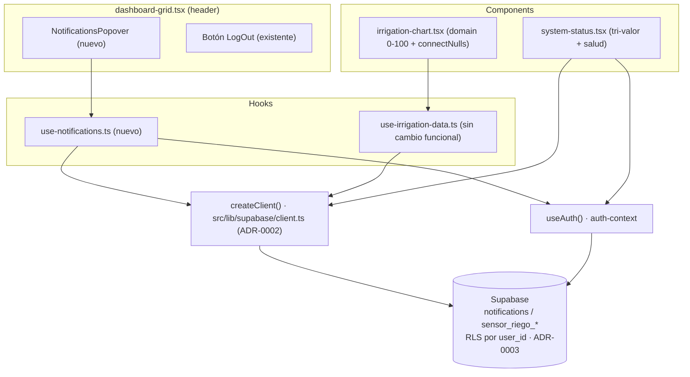
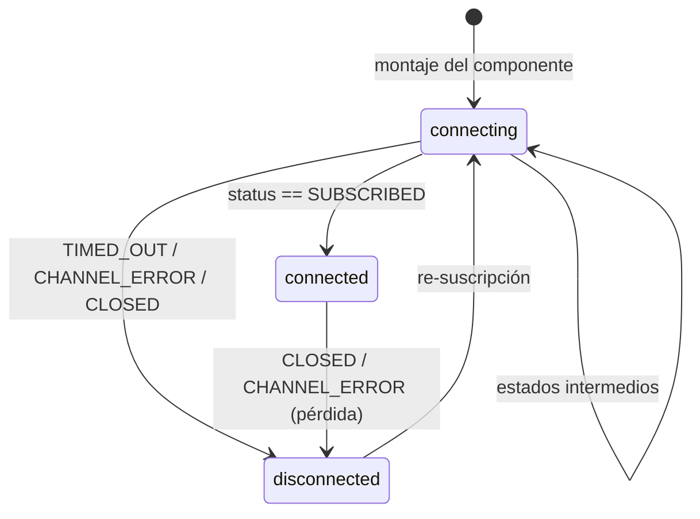

# Design: fix-dashboard-frontend

> Diseño técnico de los 5 bugs del dashboard. Anclado en el código real bajo `src/` del worktree.
> App activa = `src/` en la raíz (tsconfig `@/*` → `./src/*`). `tesis-nextjs/` es código muerto — NO se toca.

## Resumen de cambios por bug

| Bug | Spec | Archivo principal | Tipo de cambio |
|-----|------|-------------------|----------------|
| 1. Escala eje humedad | `irrigation-chart-y-scale` | `src/components/dashboard/irrigation-chart.tsx` | edición mínima |
| 2. Gaps de sensores | `irrigation-chart-sensor-gaps` | `irrigation-chart.tsx` (+ verificación de `use-irrigation-data.ts`) | edición mínima |
| 3. Notificaciones UI | `notifications-display-and-read` | `use-notifications.ts` (nuevo) + `notifications-popover.tsx` (nuevo) + `dashboard-grid.tsx` | nuevos + integración |
| 4. Estado realtime | `realtime-connection-state` | `system-status.tsx` | reescritura parcial |
| 5. Salud general | `system-health-overall` | `system-status.tsx` | efecto colateral de Bug 4 |

---

## Decisiones Técnicas

### D1 — Escala del eje Y fija 0–100 % en ambas vistas (Bug 1)

**Contexto**: `irrigation-chart.tsx:95` usa `domain={viewMode === "sum" ? [40, 100] : ["auto", "auto"]}`. La vista sumatoria recorta lecturas bajas (parte en 40); la apilada deja que Recharts auto-escale al rango de datos, lo que distorsiona (p.ej. escala 0–4). La humedad ya está en escala 0–100 % en BD (verificado), así que NO hay normalización.

**Decisión**: Fijar `domain={[0, 100]}` para ambos `viewMode`. Conservar intactos los `ReferenceArea` 40–100 (las 4 franjas) en la vista sumatoria. No tocar el mapeo de `chartData`.

**Justificación**: Es el cambio mínimo que satisface la spec (eje completo desde el inicio, sin transformación de datos). Recharts respeta un `domain` numérico fijo sin re-escalar.

**Alternativas descartadas**:
- Normalizar/escalar valores → descartado: los datos ya son porcentaje (verificado en BD), introduciría un bug.
- `domain={[0, "dataMax"]}` → descartado: no garantiza el techo 100 % y reintroduce auto-escalado.

> Nota a sdd-apply: con `domain` fijo en la vista sumatoria, agregar `allowDataOverflow={false}` no es necesario; mantener el `YAxis` simple. La etiqueta dinámica del eje (`label.value`) se conserva.

### D2 — Gaps de sensores: ausencia de dato, no salto a cero (Bug 2)

**Contexto**: `use-irrigation-data.ts:64–76` ya alinea los 3 sensores por timestamp exacto e **inserta `null`** cuando un sensor no tiene lectura en ese instante (`r20?.humedad ?? null`). El array resultante ya contiene `null` para los huecos. El problema visual está en cómo Recharts dibuja esos `null`.

**Decisión**:
1. El hook `use-irrigation-data.ts` **ya cumple** la parte de datos (no inventa valores, alinea por timestamp, usa `null` en huecos). No requiere cambio funcional para gaps. Solo se revisa que `chartData` en el chart no convierta `null` en `0`.
2. En `irrigation-chart.tsx`: agregar `connectNulls={false}` a cada `<Line>` (sensor20/40/60 y average) para que las líneas se **interrumpan** en los huecos en lugar de saltar/unir. Recharts omite los puntos `null` cuando `connectNulls={false}` (default ya es false, pero se hace explícito para robustez y legibilidad de la intención).
3. Verificar que el mapeo `chartData` (líneas 34–51) preserve `null` sin coaccionar a `0`. Hoy asigna `sensor20: s1` (donde `s1` puede ser `null`) — correcto, no se modifica esa coacción.

**Justificación**: La causa raíz de "salto a cero" reportada se neutraliza al fijar el eje en 0–100 (D1) — un valor real bajo ya no parece un colapso de escala. Para huecos verdaderos (`null`), `connectNulls={false}` produce la interrupción esperada. KISS: no se reescribe el hook.

**Alternativas descartadas**:
- Reescribir el alineamiento del hook → descartado (YAGNI): ya produce `null` correcto.
- `connectNulls={true}` → descartado: uniría artificialmente extremos de un hueco, violando "no inventar valores".

> Nota a sdd-apply: si al inspeccionar el render se detecta que `chartData` está coaccionando algún `null` a `0` (no es el caso actual), corregir ahí. La edición de `use-irrigation-data.ts` queda **condicional** y de bajo riesgo; preferentemente NO tocar el hook.

### D3 — Estado de conexión realtime tri-valor (Bug 3)

**Contexto**: `system-status.tsx:93` crea un canal `"status-check"` **sin ningún `.on(...)`**. Un canal vacío en Supabase Realtime nunca alcanza `SUBSCRIBED` de forma fiable, por lo que `realtimeConnected` queda en `false`. Además el estado es binario (conectado/desconectado), sin reflejar la transición. La spec exige tres estados y reacción a eventos reales del servidor.

**Decisión**:
1. **Tipo de estado tri-valor**: introducir `type ConnectionState = "connecting" | "connected" | "disconnected"`. Estado inicial `"connecting"` (el dashboard arranca estableciendo la conexión, no "desconectado de entrada").
2. **Canal con oyente real**: el canal debe tener al menos un `.on("postgres_changes", ...)` sobre una tabla del usuario para que el servidor lo trate como suscripción válida y confirme `SUBSCRIBED`. Se suscribe a INSERT en `sensor_riego_20` filtrado por `user_id` (la tabla de sensores ya existente, RLS la acota — ver ADR-0003). El callback del oyente puede ser un no-op o disparar un refresco ligero del descubrimiento de sensores (opcional, ver más abajo); no es necesario para el estado de conexión.
3. **Mapeo de estados** del callback de `.subscribe((status) => ...)`:
   - `SUBSCRIBED` → `"connected"`
   - `TIMED_OUT` | `CHANNEL_ERROR` | `CLOSED` → `"disconnected"`
   - cualquier otro (estado inicial / en proceso) → `"connecting"`
4. **Obtención del `user_id`**: el componente debe resolver la sesión antes de armar el filtro. Reutilizar `useAuth()` (ya disponible vía `auth-context`) para obtener `user.id`, evitando una segunda llamada a `auth.getUser()`. El canal se crea dentro de un `useEffect` que depende de `user?.id`.
5. **Limpieza**: guardar la referencia del canal y del cliente en variables del efecto y llamar `supabase.removeChannel(channel)` en el cleanup (el código actual crea **dos** instancias de cliente distintas — una para subscribe, otra para removeChannel —, lo cual es un bug latente; se corrige usando una sola instancia).

**Justificación**: Un canal con oyente real es requisito de la spec ("no es posible confirmar un canal vacío"). El tri-valor permite a la UI mostrar "Conectando…" durante el establecimiento, cumpliendo el Scenario de transición. Reusar `useAuth()` respeta DRY y el patrón de cliente browser (ADR-0002, propaga cookies → Realtime respeta RLS con JWT, ADR-0003).

**Alternativas descartadas**:
- Canal de `broadcast` puro → descartado: requiere un emisor; `postgres_changes` sobre tabla propia es más simple y ya hay datos.
- Mantener estado binario → descartado: la spec exige estado intermedio explícito.
- Llamar `auth.getUser()` dentro del componente → descartado (DRY): `useAuth()` ya expone el usuario.

> Decisión sobre ADR nuevo: el patrón "tri-valor de estado de conexión realtime" se usa **en un solo componente** (`system-status.tsx`); no hay un segundo consumidor que justifique un contrato arquitectónico reutilizable. Aplicando YAGNI, **no se crea ADR nuevo**. Si en el futuro otro componente necesita el mismo estado, se extraería a un hook `use-realtime-status.ts` y entonces sí ameritaría ADR. Se referencian ADR-0002 (cliente browser) y ADR-0003 (RLS/JWT en Realtime).

### D4 — Salud general coherente con el tri-valor (Bug 5)

**Contexto**: `system-status.tsx:189,197` calcula `todosOnline && realtimeConnected ? "Optimo" : "Parcial"`. Como `realtimeConnected` siempre era `false`, quedaba atascado en "Parcial". La spec pide "Óptimo" solo si todos los sensores online Y realtime activo; "Parcial" si algún componente caído pero al menos uno operativo; y contempla un estado de falla total.

**Decisión**: Derivar la salud del nuevo `connectionState`:
- `"Óptimo"` ⟺ `todosOnline && connectionState === "connected"`.
- `"Parcial"` ⟺ no es óptimo **pero** algún componente operativo (`onlineCount > 0 || connectionState === "connecting" || connectionState === "connected"`).
- `"Sin datos"` ⟺ ningún sensor descubierto (`totalDescubiertos === 0`) **y** `connectionState === "disconnected"` (caso de falla total). El icono `Activity` en rojo; badge en estilo destructivo.

Mientras `connectionState === "connecting"` o `cargando`, la salud se muestra como "Parcial" (no afirma óptimo sin confirmación), coherente con el indicador de conexión.

**Justificación**: Se corrige como efecto colateral directo del Bug 3 (lo dice la spec). El tercer estado "Sin datos" cubre el acceptance criterion de falla total sin introducir lógica nueva pesada.

**Alternativas descartadas**:
- Dejar binario Óptimo/Parcial → descartado: el acceptance criterion menciona explícitamente un estado de falla total.

### D5 — Hook `use-notifications.ts` (Bug 2-notificaciones / spec notifications)

**Contexto**: La tabla `notifications` existe (schema verificado: `id bigint, user_id uuid, title text, message text, read boolean nullable, created_at timestamptz`, tipo `Notification` en `src/types/index.ts`). No hay hook ni UI. RLS acota por `auth.uid() = user_id` (ADR-0003), por lo que el SELECT/UPDATE con cliente browser (cookies, ADR-0002) ya queda aislado por usuario.

**Decisión — API del hook**:

```ts
// src/hooks/use-notifications.ts
"use client"

export interface UseNotifications {
  notifications: Notification[]   // orden created_at DESC
  unreadCount: number             // notifications.filter(n => !n.read).length
  isLoading: boolean
  markAsRead: (id: number) => Promise<void>  // UPDATE read=true WHERE id (RLS acota)
}

export function useNotifications(): UseNotifications
```

Comportamiento:
- **Fetch inicial**: `select("*").order("created_at", { ascending: false })`. No se filtra manualmente por `user_id` para seguridad (RLS lo garantiza), pero el cliente browser propaga la sesión (ADR-0002) → la query devuelve solo filas del usuario.
- **`unreadCount`** se deriva de `notifications` (no se mantiene en estado separado): `notifications.filter(n => n.read !== true).length`. Nota: `read` es **nullable** → tratar `null`/`false` como "no leída"; solo `read === true` cuenta como leída.
- **`markAsRead(id)`**: actualización **optimista** del estado local (marca la fila `read=true` de inmediato → el contador baja sin esperar red), luego `update({ read: true }).eq("id", id)`. Si el UPDATE falla, revertir la fila al estado previo. Esto satisface "el contador disminuye de inmediato".
- **Realtime (opcional, recomendado)**: suscribir a `postgres_changes` (INSERT/UPDATE) sobre `notifications` filtrado por `user_id` para reflejar notificaciones nuevas sin recargar. El `user_id` se obtiene vía `useAuth()`. Si se considera fuera de alcance mínimo, dejarlo como mejora pero el fetch inicial + optimista cubre los acceptance criteria. **Decisión**: incluir la suscripción Realtime (bajo costo, consistente con el resto del dashboard y con la spec que habla de tiempo real).
- **Cliente**: `createClient()` de `@/lib/supabase/client` (ADR-0002).

**Justificación**: Derivar `unreadCount` de la lista evita estado duplicado (single source of truth). La actualización optimista cumple "inmediato". RLS + cliente con cookies cubren el aislamiento sin filtros manuales frágiles.

**Alternativas descartadas**:
- Mantener `unreadCount` en `useState` separado → descartado (DRY/bug-prone): se desincroniza de la lista.
- Filtrar manualmente por `user_id` en el SELECT por "seguridad" → innecesario: RLS es la frontera de seguridad (ADR-0003). (Se puede añadir como optimización de claridad, no como control de seguridad.)

### D6 — Componente `notifications-popover.tsx`

**Contexto**: `src/components/ui/popover.tsx` existe y usa **Base UI** (`@base-ui/react/popover`), no Radix. Exporta `Popover`, `PopoverTrigger`, `PopoverContent` (+ Header/Title/Description). También existen `badge.tsx` y `scroll-area.tsx` (Base UI). Icono de campana: `Bell` de `lucide-react` (ya se usan iconos lucide en el proyecto).

**Decisión — estructura**:

```tsx
// src/components/dashboard/notifications-popover.tsx
"use client"
// usa useNotifications() + Popover/PopoverTrigger/PopoverContent + Badge + ScrollArea + Bell (lucide)

export function NotificationsPopover() { ... }
```

Composición:
- **Trigger**: `PopoverTrigger` envolviendo un `Button variant="ghost" size="sm"` (mismo estilo que el botón LogOut del header) con `<Bell size={15} />`. Si `unreadCount > 0`, superponer un `Badge variant="destructive"` posicionado absoluto (esquina superior derecha del botón) mostrando el número (cap visual "9+" si `> 9`). Si `unreadCount === 0`, sin badge. `aria-label="Notificaciones"` y, cuando hay no leídas, anunciar el conteo para accesibilidad.
- **Content**: `PopoverContent` con `align="end"` (el botón está a la derecha del header). Encabezado con título "Notificaciones". Lista dentro de `ScrollArea` con `max-h-[320px]`.
  - Cada item: `title` (font-medium), `message` (text-muted-foreground, text-xs), fecha relativa/corta de `created_at`. Las leídas se muestran atenuadas (opacity reducida) — no se eliminan de la lista, se distinguen visualmente (la spec admite "desaparece O se distingue"). Las no leídas muestran un botón/acción "Marcar como leída" (icono `Check` lucide o botón ghost) que invoca `markAsRead(id)`.
  - **Estado vacío**: si `notifications.length === 0`, mostrar texto informativo centrado ("Sin notificaciones").
  - **Loading**: si `isLoading`, mostrar 2–3 `Skeleton` (componente existente).
- **Cierre en click**: Base UI `Popover.Root` no cierra al hacer click en un item (no es un menú). El click en "marcar como leída" NO debe cerrar el popover (el usuario puede marcar varias). Esto es el comportamiento natural de Base UI Popover; no requiere manejo especial.

**Justificación**: Reutiliza primitivos UI existentes (Popover/Badge/ScrollArea/Skeleton/Button) → consistencia visual y DRY. "Distinguir visualmente como leída" (en vez de eliminar) preserva el historial y cumple la spec.

**Alternativas descartadas**:
- Usar `dialog.tsx`/`sheet.tsx` → descartado: la spec pide un "panel" anclado al ícono del header; Popover es el patrón correcto y más liviano.
- Eliminar la notificación de la lista al marcarla → permitido por spec pero descartado: atenuar es menos destructivo y conserva contexto; además el sistema "no elimina" notificaciones.

### D7 — Integración en el header de `dashboard-grid.tsx`

**Contexto**: `dashboard-grid.tsx:52–64` tiene la zona de acciones del header: `<span>{user?.email}</span>` + botón LogOut, dentro de `<div className="flex items-center gap-3">`.

**Decisión**: Insertar `<NotificationsPopover />` dentro de ese `div`, **entre** el email y el botón LogOut (orden: email · campana · logout). Importar el componente al inicio del archivo. No se cambia layout del grid ni el resto del header.

**Justificación**: Punto de integración ya identificado en exploration; el `flex items-center gap-3` acomoda el nuevo control sin ajustes de estilo. La campana queda agrupada con las acciones de usuario.

---

## Arquitectura



Estado de conexión realtime (D3):



---

## Output Expected

Rutas EXACTAS bajo `src/` del worktree. (NO tocar `tesis-nextjs/`.)

- `src/components/dashboard/irrigation-chart.tsx` — **MODIFICAR**. Cambiar `domain` del `<YAxis>` a `[0, 100]` para ambos `viewMode` (línea ~95). Añadir `connectNulls={false}` explícito a los 4 `<Line>` (sensor20/40/60 y average). Conservar `ReferenceArea` 40–100 y mapeo `chartData` (no coaccionar `null` a 0).
- `src/hooks/use-irrigation-data.ts` — **VERIFICAR / sin cambio esperado**. Confirmar que sigue insertando `null` en huecos (líneas ~64–76) y no inventa valores. Edición condicional solo si se detecta coacción a 0; preferentemente NO modificar.
- `src/components/dashboard/system-status.tsx` — **REESCRITURA PARCIAL**. (a) Reemplazar `realtimeConnected: boolean` por `connectionState: "connecting" | "connected" | "disconnected"` (inicial `"connecting"`). (b) Canal realtime con oyente real (`.on("postgres_changes", { event: "INSERT", schema: "public", table: "sensor_riego_20", filter: user_id })`) usando una **única** instancia de `createClient()` y `user.id` de `useAuth()`; mapear todos los status en `.subscribe((status)=>...)`. (c) Cleanup con `removeChannel` sobre la misma instancia. (d) Recalcular salud general: Óptimo / Parcial / Sin datos según D4. (e) Actualizar los badges/iconos del indicador de "Conexion Realtime" para reflejar 3 estados (texto: Conectado / Conectando… / Desconectado; colores verde / amarillo / rojo).
- `src/hooks/use-notifications.ts` — **NUEVO**. Hook con API de D5: `{ notifications, unreadCount, isLoading, markAsRead }`. Fetch `notifications` orden `created_at` DESC, `unreadCount` derivado (tratar `read` nullable como no-leída salvo `=== true`), `markAsRead` optimista + UPDATE `read=true` con rollback ante error, suscripción Realtime a `notifications` filtrada por `user_id` (vía `useAuth()`). Cliente `createClient()` (ADR-0002).
- `src/components/dashboard/notifications-popover.tsx` — **NUEVO**. Componente `NotificationsPopover` según D6: `Popover`+`PopoverTrigger`+`PopoverContent` (Base UI), `Button` ghost con `Bell` (lucide), `Badge variant="destructive"` con `unreadCount` (oculto si 0, "9+" si >9), `ScrollArea` con lista, items con título/mensaje/fecha, acción "marcar como leída" (`Check` lucide) en no leídas, estado vacío y `Skeleton` en loading. `align="end"`.
- `src/components/dashboard/dashboard-grid.tsx` — **MODIFICAR**. Importar `NotificationsPopover` y renderizarlo en la zona de acciones del header (línea ~52–64), entre `{user?.email}` y el botón LogOut.

**Sin cambios de schema ni migraciones** — la tabla `notifications` y `sensor_riego_*` ya existen con RLS (ADR-0003). Este cambio es 100 % frontend (repo Vercel).

---

## Contratos de Componentes

```ts
// src/hooks/use-notifications.ts
import type { Notification } from "@/types"

export interface UseNotifications {
  notifications: Notification[]
  unreadCount: number
  isLoading: boolean
  markAsRead: (id: number) => Promise<void>
}
export function useNotifications(): UseNotifications

// src/components/dashboard/notifications-popover.tsx
export function NotificationsPopover(): JSX.Element   // sin props; consume useNotifications()

// src/components/dashboard/system-status.tsx (interno)
type ConnectionState = "connecting" | "connected" | "disconnected"
type SystemHealth = "Optimo" | "Parcial" | "Sin datos"
```

`Notification` (existente, `src/types/index.ts`): `{ id: number; user_id: string; title: string; message: string; read: boolean; created_at: string }` — nota: en BD `read` es nullable; el hook trata `null` como no-leída.

---

## Estrategia de Testing

No hay infraestructura de tests automatizados en el proyecto (no se detectó runner). Verificación manual guiada por los Scenarios de cada spec, durante sdd-verify:

- **Bug 1**: abrir ambas vistas del gráfico; confirmar eje 0–100 en sumatoria y apilada; con lecturas bajas reales (0–4 %) el eje no colapsa y la franja 40–100 sigue visible.
- **Bug 2**: con un sensor sin datos en un intervalo, su línea se interrumpe (no salta a 0) y los otros dos siguen continuos.
- **Bug 3**: al cargar, el indicador pasa por "Conectando…" y llega a "Conectado" (verde) cuando el canal confirma `SUBSCRIBED`; simular desconexión (offline) → "Desconectado".
- **Bug 5**: con todos los sensores online + realtime conectado → "Óptimo"; degradar cualquiera → "Parcial"; sin sensores y sin conexión → "Sin datos".
- **Notificaciones**: con el seed de 223 filas `read=false`, la campana muestra el contador; abrir panel lista en orden DESC; "marcar como leída" baja el contador de inmediato y atenúa la fila; segundo usuario solo ve las suyas (aislamiento RLS).
- Validación estática: `tsc --noEmit` / build de Next.js debe pasar sin errores de tipo.

---

## ADRs

- No se crean ADRs nuevos. Decisiones cubiertas por:
  - **[[0002-supabase-ssr-client-pattern]]** — uso de `createClient()` browser (cookies) en el hook de notificaciones y en la suscripción realtime client-side.
  - **[[0003-rls-user-id-per-row-isolation]]** — aislamiento por usuario del SELECT/UPDATE de `notifications` y del filtro `user_id` en los canales Realtime (RLS respeta el JWT).
- El patrón tri-valor de conexión realtime (D3) NO amerita ADR: alcance de un solo componente (YAGNI). Se documenta aquí; se promovería a hook + ADR solo si surge un segundo consumidor.
