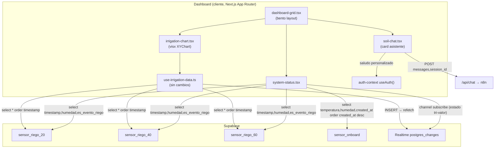
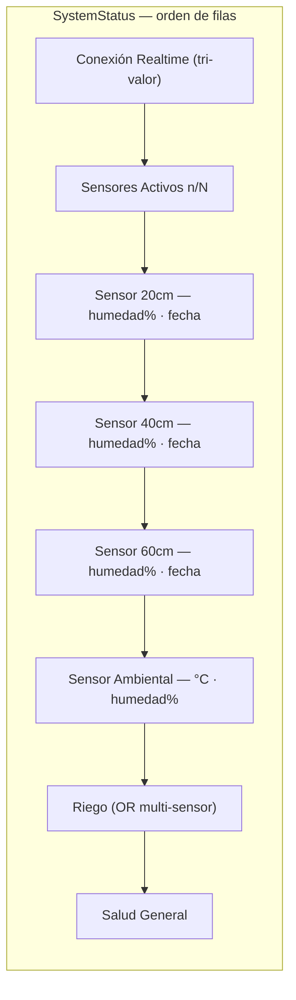

# Design: fix-dashboard-realtime-status

Diseño técnico del rework del dashboard agrícola (Next.js 16.2.2 + React 19.2.4, App Router, Supabase, deploy Vercel). El cambio toca exclusivamente la capa de presentación y data-fetching del cliente; no modifica backend ni esquema Supabase. Cubre las 6 specs activas del `spec_refs`.

Mapa spec → archivo:

| Spec | Capability | Archivo principal |
|------|-----------|-------------------|
| `[[sensor-readings-display]]` | system-status | `src/components/dashboard/system-status.tsx` |
| `[[ambient-sensor-row]]` | system-status | `src/components/dashboard/system-status.tsx` |
| `[[irrigation-active-detection]]` | system-status | `src/components/dashboard/system-status.tsx` |
| `[[chart-visx-rendering]]` | irrigation-chart | `src/components/dashboard/irrigation-chart.tsx` + `.npmrc` |
| `[[assistant-card-ui]]` | soil-chat | `src/components/dashboard/soil-chat.tsx` |
| `[[dashboard-bento-grid]]` | dashboard-layout | `src/components/dashboard/dashboard-grid.tsx` |

---

## Decisiones Técnicas

### D1: Query extendida de `sensor_riego_*` con humedad y separación de descubrimiento/lectura

**Contexto**: `sensor-readings-display` exige que cada sensor de riego muestre `% humedad` + fecha/hora compacta de su última lectura. Hoy el `select` en `system-status.tsx:56-58` pide solo `timestamp, es_evento_riego` y el campo `humedad` nunca llega al cliente; `lastReading` solo formatea la fecha.

**Decisión**: Extender el `select` de cada tabla candidata a `"timestamp, humedad, es_evento_riego"`. El resto del pipeline de descubrimiento (ventana 24h, `maybeSingle`, umbral online 30min) se conserva intacto. Se enriquece `SensorDescubierto` con un campo `humedad: number | null`, y `lastReading` se mantiene como string ya formateado.

**Justificación**: Es el cambio mínimo sobre la query existente; reutiliza la columna `humedad` que ya existe en el tipo `SensorRiego` (`src/types/index.ts:8`, `double precision 0–100`). No introduce una segunda query por sensor.

**Alternativas descartadas**: `select("*")` — trae conductividad, ph, temperatura innecesarios y aumenta payload sin uso.

### D2: Formato de fecha compacto con discriminación hoy/anterior

**Contexto**: el AC pide formato compacto que distinga lecturas de hoy (`"hoy 14:32"`) de anteriores (`"23 may 09:10"`).

**Decisión**: Función helper local `formatLecturaCompacta(date: Date): string` dentro de `system-status.tsx`:
- Si `date.toDateString() === new Date().toDateString()` → `"hoy " + HH:mm` (es-CL, `hour/minute 2-digit`).
- En otro caso → `"DD mmm HH:mm"` (es-CL, `day 2-digit`, `month short`, `hour/minute 2-digit`).

El cómputo se hace en el momento de armar `SensorDescubierto` (dentro del `for`), usando `ultimaLectura` que ya se construye en `system-status.tsx:65`.

**Justificación**: Localiza la lógica de presentación temporal en un único helper testeable, sin librería de fechas extra (el proyecto no incluye date-fns ni dayjs y no se justifica agregarla — KISS/YAGNI).

**Alternativas descartadas**: `Intl.RelativeTimeFormat` — produce "hace 2 horas" en vez del formato hora explícito que pide la spec.

### D3: Detección de riego multi-sensor (fix de `irrigation-active-detection`)

**Contexto**: `system-status.tsx:69-72` solo evalúa `es_evento_riego` cuando `descubiertos.length === 0` (el primer sensor con datos). Si el segundo o tercer sensor riega y el primero no, el indicador queda apagado: bug #5.

**Decisión**: Eliminar la guarda `descubiertos.length === 0`. Acumular un flag local `regandoAlguno` con OR sobre todos los sensores con datos: `if (data.es_evento_riego) regandoAlguno = true`. Tras el `for`, llamar `setIrrigating(regandoAlguno)` una sola vez.

**Justificación**: Cambiar a una variable local evita múltiples `setIrrigating` dentro del loop (re-renders innecesarios) y refleja la semántica "cualquier sensor". `setIrrigating(false)` explícito al final cubre el escenario "ningún sensor regando" y "sin sensores" sin estado residual.

**Alternativas descartadas**: `setIrrigating(prev => prev || data.es_evento_riego)` por sensor — funciona pero dispara N actualizaciones de estado y no resetea entre re-descubrimientos.

### D4: Sensor ambiental como fila adicional con query separada a `sensor_onboard`

**Contexto**: `ambient-sensor-row` pide una fila dedicada con temperatura °C + humedad % de la última lectura de `sensor_onboard`, ordenada por `created_at` (no `timestamp`, por drift de firmware). `sensor_onboard` no tiene `depth` y no encaja en el array `SENSOR_TABLES`.

**Decisión**:
- Nuevo estado `const [ambiental, setAmbiental] = useState<{ temperatura: number | null; humedad: number | null } | null>(null)`.
- Query separada dentro del mismo `useEffect` de descubrimiento (o en uno propio dependiente de `user?.id`), filtrando por usuario:
  ```
  createClient()
    .from("sensor_onboard")
    .select("temperatura, humedad, created_at")
    .eq("user_id", user.id)
    .order("created_at", { ascending: false })
    .limit(1)
    .maybeSingle()
  ```
- Si `data` → `setAmbiental({ temperatura, humedad })`; si error/null → `setAmbiental(null)` (estado sin datos).
- Render: fila nueva con ícono `Thermometer`/`Droplet` mostrando `${temperatura}°C · ${humedad}%`; si `ambiental == null` → "Sin datos". La fila se ubica tras las filas de sensores de riego y antes de la fila de Riego, claramente etiquetada "Sensor Ambiental".

**Justificación**: Coincide con DT-4 (fila, no card nueva): mínimo impacto en el bento, sin tocar `dashboard-grid.tsx`. El filtro `eq("user_id", user.id)` mantiene el aislamiento multi-tenant ya vigente (`[[frontend-onboard-query]]`, `[[rls-policies-sensors]]`). El orden por `created_at` honra explícitamente el requirement de la spec.

**Alternativas descartadas**: incluir `sensor_onboard` dentro de `SENSOR_TABLES` — el tipo del array exige `depth` y la semántica (temperatura/humedad vs profundidad) difiere; forzarlo rompería el `sort((a,b)=>a.depth-b.depth)`.

> **Nota de scope**: `system-status.tsx` (este cambio) lee `sensor_onboard` filtrando por `user_id` directamente en el cliente. `[[frontend-onboard-query]]` (completed) ya estableció el patrón de leer onboard desde `sensor_onboard` filtrado por usuario; este diseño lo aplica a una nueva superficie de UI sin contradecirlo.

### D5: Migración del gráfico a `@visx/xychart` (Approach A) — manejo de gaps y zonas

**Contexto**: `chart-visx-rendering` (+ herencia de `[[irrigation-chart-y-scale]]` y `[[irrigation-chart-sensor-gaps]]`) exige reescribir `irrigation-chart.tsx` de Recharts a `@visx/xychart`, conservando vistas Apilado/Sumatoria, colores `#0071FF`/`#00E396`/`#FEB019`, gaps no conectados, eje Y 0–100, tooltip oscuro y las franjas de referencia agronómicas.

**Decisión**: Adoptar `@visx/xychart` (Approach A de la exploración, DT-1). Estructura del componente:

- **Responsividad**: envolver `XYChart` en `<ParentSize>` de `@visx/responsive` para obtener `width/height` del contenedor flex; pasar esas dimensiones a `XYChart`. Reemplaza el `ResponsiveContainer` de Recharts.
- **Escalas**: `xScale={{ type: "time" }}`, `yScale={{ type: "linear", domain: [0, 100], zero: true }}`. El `domain` fijo cumple `irrigation-chart-y-scale` sin auto-escalar.
- **Tema**: `buildChartTheme` con `colors: ["#0071FF", "#00E396", "#FEB019"]`, `backgroundColor` transparente, `gridColor: "#55555533"`, `tickLength` y `xTickLineStyles`/`yTickLineStyles` con `fill: "#c9c9c9"`.
- **Ejes/grid**: `<AnimatedGrid columns={false} numTicks={4} />`, `<AnimatedAxis orientation="bottom" />` (tickFormat fecha `DD mmm`), `<AnimatedAxis orientation="left" numTicks={5} />`.
- **Accessors**: cada punto del dataset normalizado es `{ date: Date, sensor20, sensor40, sensor60, average }`. `xAccessor = d => new Date(d.date)`, `yAccessor` por serie.
- **Manejo de gaps (decisión clave)**: visx `AnimatedLineSeries` no soporta un flag tipo `connectNulls={false}`. Se resuelve **filtrando nulls por serie** (no segmentando): cada serie recibe `data.filter(d => d.<serie> != null)` con su propio array. Así un punto faltante en sensor60 simplemente no existe en su dataset y la línea no traza sobre el hueco; las demás series mantienen sus puntos. Esto cumple `irrigation-chart-sensor-gaps` (interrupción natural, sin salto a cero) y es más simple que segmentar la serie en sub-líneas.

  > Trade-off del filtrado vs segmentar: filtrar conecta los dos extremos de un hueco *interior* con una recta (no hay punto intermedio). Para gaps de borde (sensor sin datos en un tramo final/inicial) el comportamiento es idéntico al deseado. Dado que las lecturas son densas (ingesta periódica) y la spec describe el caso de "un sensor sin lecturas durante un intervalo" — típicamente un tramo contiguo de borde — el filtrado es suficiente. Si en `sdd-verify` se observa una recta cruzando un hueco interior largo, la mitigación es segmentar esa serie (agrupar en sub-arrays contiguos y renderizar un `LineSeries` por segmento). Se documenta como riesgo, no se implementa por defecto (YAGNI).

- **Vistas**:
  - *Apilado* (`viewMode === "stacked"`): tres `AnimatedLineSeries` (`dataKey` sensor20/40/60), cada una con su dataset filtrado. Leyenda vía `<text>`/badges propios o el `Tooltip` (visx no trae `<Legend>` como Recharts; se usa una fila de chips de color sobre el gráfico, reutilizando los 3 colores).
  - *Sumatoria* (`viewMode === "sum"`): una sola `AnimatedLineSeries` de `average` en `#0071FF`, más las **franjas agronómicas** de fondo.
- **Franjas de referencia (zonas agronómicas en Sumatoria)**: Recharts las dibuja con `ReferenceArea` (`y1/y2`). visx `XYChart` no expone `ReferenceArea`; se posicionan como bandas SVG de fondo:
  - Las 4 bandas (`90–100` Nivel de Lleno `#0071FF`, `70–90` Punto de Recarga `#00E396`, `55–70` Inicio de Estrés `#FEB019`, `40–55` Peligro Estrés Extremo `#fe2819`) se dibujan con `<Annotation>` + `<AnnotationLineSubject>` o, más simple y robusto, como `<rect>` SVG absolutos calculados con la `yScale` del chart. Dado que `XYChart` administra su propia escala internamente, se usa un `<rect>` posicionado vía un componente hijo que accede a la escala con el hook `useContext(DataContext)` de `@visx/xychart`, mapeando `yScale(90)`→`yScale(100)` a coordenadas de pixel y dibujando bandas con `fillOpacity` 0.10–0.15 + `<text>` de etiqueta. Las bandas se renderizan **antes** de las series (z-order de fondo).

    > Alternativa más barata aceptable: dibujar las bandas con `@visx/shape` `Bar`/`rect` en un `<svg>` superpuesto sincronizado por dimensiones; se prefiere el acceso a `DataContext` para que las bandas usen exactamente la misma `yScale` que las series y no se desalineen al cambiar de vista.

- **Eventos de riego (marca "Riego" en Apilado)**: hoy Recharts dibuja un `ReferenceArea` vertical por día con evento. En visx se representa con un glyph/línea vertical por cada `irrigation_event`: un componente hijo que, vía `DataContext`, mapea `xScale(new Date(evento))` a x-pixel y dibuja una línea vertical tenue `#0071FF` opacidad 0.15. Si el costo es alto, se degrada a un `<GlyphSeries>` de marcadores en el eje X (aceptable; la spec `chart-visx-rendering` no lista los marcadores de riego como AC — son herencia visual del componente Recharts, "nice to have").

- **Tooltip**: `<Tooltip>` de `@visx/xychart` con `snapTooltipToDatumX`, `showVerticalCrosshair`, `showSeriesGlyphs`, y `renderTooltip` que muestra fecha + valores por serie con fondo `#2a2a2a`, texto `#c9c9c9`, borde `#272832` (estilos vía `applyPositionStyle` + clase propia, o `style` inline en el contenedor de `renderTooltip`).

- **Normalización del dataset**: la transformación de `IrrigationData` (arrays paralelos `dates/sensor1/2/3`) a `{ date, sensor20, sensor40, sensor60, average }[]` se conserva tal cual está hoy (`irrigation-chart.tsx:34-51`), cambiando `dateLabel` (string) por `date: Date` para `xScale: time`. El cálculo de `average` (promedio de valores no-null) se mantiene.

**Justificación**: Approach A da el estilo XYChart de visx.airbnb.tech/xychart con menos boilerplate que las primitivas (Approach B). El peer conflict React 19 ↔ `@visx/react-spring` (que ancla `@react-spring/web@^9`) es declarativo, no funcional, y se resuelve con `.npmrc legacy-peer-deps=true` (ver D6 / ADR-0004).

**Alternativas descartadas**:
- *Approach B (primitivas `@visx/scale`+`@visx/axis`+`@visx/shape`)*: evita el peer conflict pero exige SVG manual, ResizeObserver propio y tooltip a mano — esfuerzo L sin beneficio visual (DT-1).
- *Approach C (mantener Recharts)*: incumple el objetivo 3 del intent.

### D6: `.npmrc legacy-peer-deps=true` y plan de dependencias

**Contexto**: `@visx/xychart@3.12.0` declara peers `react: ^16||^17||^18` y depende transitivamente de `@visx/react-spring@3.12.0`, que ancla `@react-spring/web@^9.4.5`. El proyecto corre React 19.2.4 y, para soportarlo, `@react-spring/web` debe ser v10 (latest 10.1.0). npm aborta el install por `ERESOLVE` sin override.

**Decisión**: Crear `.npmrc` en la raíz del repo con:
```
legacy-peer-deps=true
```
Instalar:
- `@visx/xychart@^3.12.0`
- `@visx/responsive@^3.12.0`
- `@react-spring/web@^10` (explícito, para que el runtime use la versión compatible con React 19 aunque `@visx/react-spring` declare v9)

**Impacto en lockfile**: el proyecto NO tiene lockfile commiteado actualmente (no se halló `package-lock.json`/`pnpm-lock.yaml` en el árbol). El primer `npm install` con `.npmrc` generará `package-lock.json`. Vercel respeta `.npmrc` en build, por lo que el deploy resolverá los peers de la misma forma. Revisar tras instalar que no se degradaron versiones de otras deps (riesgo documentado en ADR-0004).

**Justificación**: Es la solución estándar para conflictos de peer-deps declarativos cuando la incompatibilidad no es funcional. Ver ADR-0004 para la decisión completa, scope y alternativas (override puntual vs flag global).

### D7: Rediseño de `SoilChat` como card asistente

**Contexto**: `assistant-card-ui` pide ícono de asistente, saludo personalizado (con fallback en cascada), 3–4 badges de sugerencias fijas, `<Textarea>` con barra de acciones inferior, conservando el flujo `/api/chat` → n8n y el render markdown; sin selector de modelo ni adjuntar/audio.

**Decisión**: Reescribir solo la capa de presentación de `soil-chat.tsx`. La lógica (`handleSend`, `sessionId`, fetch a `/api/chat`, `messages`, scroll, markdown components) se conserva intacta. Cambios:

- **Acceso al usuario**: `const { user } = useAuth()`. Helper de saludo:
  ```
  const nombre =
    (user?.user_metadata?.full_name as string | undefined)?.trim()
    || user?.email?.split("@")[0]
    || null
  const saludo = nombre ? `¡Hola, ${nombre}!` : "¡Hola!"
  ```
  Cumple la cascada `full_name → prefijo email → genérico` (riesgo "full_name null" mitigado).
- **Estado vacío (antes del primer mensaje)**: cuando `messages.length === 0`, renderizar un bloque centrado con:
  - Avatar/ícono `Bot` grande en círculo `bg-primary/20` (reutiliza `Avatar` de shadcn o el patrón actual con `lucide Bot`).
  - Título con el `saludo` personalizado + subtítulo "Soy tu asistente agrícola. Pregúntame sobre riego, suelo o fertilización."
  - Fila de **badges de sugerencias** (`Badge` shadcn, variant `secondary`/`outline`), 4 fijas (DT-5):
    1. "¿Cuándo debo regar?"
    2. "¿Cómo está la humedad del suelo?"
    3. "¿Qué fertilizante necesito?"
    4. "¿Hay riesgo de estrés hídrico?"
  - Click en un badge → `setInput(texto)` (lo coloca en el textarea listo para enviar/editar, conforme al scenario "Usuario selecciona un badge"). No auto-envía (la spec dice "listo para que el usuario lo envíe o modifique").
- **Conversación**: cuando `messages.length > 0`, se muestra el historial actual (mismo render de burbujas + markdown). El mensaje de bienvenida hardcoded actual (`soil-chat.tsx:101-111`) se elimina: su rol lo absorbe el estado vacío.
- **Área de escritura**: reemplazar `<Input>` (`soil-chat.tsx:205`) por `<Textarea>` (shadcn) `rows={1}` con auto-resize ligero (max ~4 líneas vía `max-h` + `overflow-auto`), `onKeyDown` con Enter=enviar / Shift+Enter=nueva línea (se conserva `handleKeyDown`). Debajo del textarea, una **barra de acciones inferior** que contiene únicamente el botón Send (`Button` + ícono `Send`). Sin botones de modelo/adjuntar/audio (SHALL NOT).
- **Colores**: usar tokens de página (`bg-card`, `text-foreground`, `bg-primary`, `border-border`) — ya alineados con `#0071FF`/`#2a2a2a`/`#c9c9c9` en `globals.css`.

**Justificación**: Aísla el cambio a JSX/estado de presentación; cero riesgo sobre la integración n8n. Todos los componentes (`textarea`, `badge`, `avatar`, `button`) ya están instalados en `src/components/ui/`. El estado vacío con badges resuelve el problema de "usuario no sabe qué preguntar" del Purpose de la spec.

**Alternativas descartadas**: mantener `<Input>` y solo añadir badges — incumple el requirement explícito de `<Textarea>` con barra inferior.

### D8: Reorganización del layout bento

**Contexto**: `dashboard-bento-grid` pide un grid bento sin solapamientos ni huecos en los breakpoints de container query, con celdas para SystemStatus, IrrigationChart y SoilChat. El grid actual (`dashboard-grid.tsx:73-124`) ya es un bento de 6 columnas con container queries (`@xl`/`@5xl`):
```
Fila 1: Weather (2) | PlantTimeline (2) | SystemStatus (2)
Fila 2: IrrigationChart (4) | SoilChat (2)
```

**Decisión**: Conservar el sistema de container queries existente (`@container` + `grid-cols-1 @xl:grid-cols-2 @5xl:grid-cols-6`) y refinar tamaños para eliminar huecos y dar jerarquía:
- **Fila 1** (3 cards informativas, `min-h-[220px]`): Weather (2) · PlantTimeline (2) · SystemStatus (2). La card de SystemStatus crece en alto si el sensor ambiental añade una fila — ya usa `flex-col justify-center`, absorbe la fila extra sin desbordar.
- **Fila 2** (2 cards de trabajo, `h-[480px]`): IrrigationChart (4) · SoilChat (2). Se mantiene la proporción 4+2 (espejo del gancho visual del dashboard).
- **Breakpoints**: en `@xl` (2 cols) las cards de 2-span ocupan 1 columna y el IrrigationChart (`@xl:col-span-2`) ocupa el ancho completo; en `<@xl` todo apila a 1 columna. Verificar que ninguna fila quede con una celda huérfana (hueco): con 3+2 cards la grilla de 6 columnas se llena exactamente (2+2+2 y 4+2).

**FertilizerChart (resolución de tensión spec ↔ proposal)**: `dashboard-bento-grid` lista como AC "FertilizerChart permanece en el layout (aunque en Recharts)". **Estado real**: `FertilizerChart` NO está montado en `DashboardGrid` hoy — es un componente huérfano (confirmado en exploración y al leer `dashboard-grid.tsx`). La proposal (aprobada) lo excluye explícitamente del bento y lo registra como deuda técnica (DT-2/DT-3). **Decisión de diseño**: respetar la proposal aprobada — NO se integra `FertilizerChart` al bento en este cambio. El AC de la spec se interpreta como "la reorganización no debe romper `FertilizerChart` si llegara a montarse" y se satisface trivialmente porque no se toca ese componente. Se registra como observación `[pre-adr/discrepancia-spec]` para que `sdd-verify` no marque FAIL por un AC que contradice la proposal aprobada. No se crea delta de spec (no es evolución de comportamiento, es una discrepancia de redacción del AC; la fuente de verdad de scope es la proposal).

**SoilRecommendations**: permanece como placeholder fuera del grid (excluido por proposal). Sin cambios.

**Justificación**: El grid ya es un bento funcional; la reorganización es un refinamiento de tamaños, no una reescritura. Reutiliza el patrón de container queries existente (KISS). Evita el riesgo de regresión de montar componentes huérfanos no pedidos.

---

## Arquitectura





---

## Output Expected

Archivos a crear/modificar:

- `.npmrc` — **crear** con `legacy-peer-deps=true` (D6, ADR-0004).
- `package.json` — **modificar**: añadir `@visx/xychart@^3.12.0`, `@visx/responsive@^3.12.0`, `@react-spring/web@^10` a `dependencies`.
- `src/components/dashboard/system-status.tsx` — **modificar**: select con `humedad` (D1); helper `formatLecturaCompacta` (D2); fix riego multi-sensor con flag local (D3); estado + query + fila de sensor ambiental (D4); enriquecer `SensorDescubierto` con `humedad`.
- `src/components/dashboard/irrigation-chart.tsx` — **reescribir**: implementación visx XYChart (D5) — `ParentSize`, escalas time/linear 0–100, tema con 3 colores, series filtradas por null, bandas agronómicas vía `DataContext`, marcas de riego, tooltip oscuro, vistas Apilado/Sumatoria.
- `src/components/dashboard/soil-chat.tsx` — **modificar**: estado vacío con avatar + saludo personalizado + badges; `<Textarea>` con barra inferior; eliminar bienvenida hardcoded; conservar `handleSend`/fetch/markdown (D7).
- `src/components/dashboard/dashboard-grid.tsx` — **modificar**: refinar tamaños de celdas del bento; sin integrar FertilizerChart (D8).

Archivos que NO se tocan: `src/hooks/use-irrigation-data.ts` (realtime ya correcto), `src/types/index.ts` (`SensorRiego.humedad` y `SensorOnboard` ya existen), `src/components/ui/chart.tsx` (wrapper Recharts — queda; lo usa FertilizerChart huérfano), `src/components/dashboard/fertilizer-chart.tsx` (deuda), `src/components/dashboard/soil-recommendations.tsx` (placeholder), `src/app/api/chat/**` (backend n8n).

---

## Contratos de Componentes

```ts
// system-status.tsx — tipo enriquecido
interface SensorDescubierto {
  table: string
  label: string
  depth: number
  status: "online" | "offline"
  humedad: number | null      // NUEVO (D1)
  lastReading: string         // formateado vía formatLecturaCompacta (D2)
}

// estado del sensor ambiental (D4)
type AmbientReading = { temperatura: number | null; humedad: number | null } | null

// helper de fecha (D2)
function formatLecturaCompacta(date: Date): string
```

```ts
// irrigation-chart.tsx — punto del dataset normalizado (D5)
interface ChartPoint {
  date: Date            // antes era dateLabel: string (Recharts)
  sensor20: number | null
  sensor40: number | null
  sensor60: number | null
  average: number | null
}
// series filtradas por null antes de pasar a AnimatedLineSeries:
//   const s20 = chartData.filter(d => d.sensor20 != null)
const accentColors = ["#0071FF", "#00E396", "#FEB019"] as const
type ViewMode = "stacked" | "sum"   // sin cambios
```

```ts
// soil-chat.tsx — sin cambios de contrato de datos; nuevas constantes de presentación
const SUGERENCIAS = [
  "¿Cuándo debo regar?",
  "¿Cómo está la humedad del suelo?",
  "¿Qué fertilizante necesito?",
  "¿Hay riesgo de estrés hídrico?",
] as const
// ChatMessage, /api/chat payload { messages, session_id } — INTACTOS
```

---

## Estrategia de Testing

El proyecto no tiene framework de tests configurado (no hay jest/vitest/playwright en `package.json`; `npm scripts` solo `dev/build/start/lint`). La verificación es manual + build, alineada con los AC de las specs:

1. **Build de producción**: `npm install` (con `.npmrc`) y `npm run build` completan sin errores (`chart-visx-rendering` AC: install + build). `npx tsc --noEmit` sin errores (verifica D1/D4 tipados).
2. **`system-status.tsx`** (verificación visual con datos reales en `develop` desplegado):
   - Cada sensor muestra `%humedad · fecha compacta`; lectura de hoy → "hoy HH:mm", anterior → "DD mmm HH:mm" (D1/D2).
   - Fila "Sensor Ambiental" con `°C · %`; sin datos → "Sin datos" (D4).
   - Riego se enciende si cualquier sensor reporta `es_evento_riego` (D3) — probar con evento en sensor40/60 y no en 20.
3. **`irrigation-chart.tsx`**:
   - Apilado: 3 series en colores correctos; Sumatoria: 1 línea + 4 bandas agronómicas alineadas a la escala 0–100 (D5).
   - Hueco en una serie → interrupción natural, sin salto a cero (gaps por filtrado).
   - Tooltip oscuro con valores; sin datos → área vacía, eje 0–100 estable, sin errores de consola.
4. **`soil-chat.tsx`**:
   - Estado vacío muestra saludo personalizado (probar usuario con/sin `full_name`), 4 badges; click en badge rellena el textarea sin enviar; envío real a `/api/chat` y respuesta markdown se renderizan (D7).
   - No hay selector de modelo, adjuntar ni audio.
5. **`dashboard-grid.tsx`**: en breakpoints `<@xl` / `@xl` / `@5xl` no hay solapamientos ni huecos; SystemStatus absorbe la fila ambiental sin desbordar (D8).
6. **Regresiones de deploy (#1/#4/#6)**: confirmar en el entorno desplegado que el gráfico actualiza en vivo, el indicador realtime muestra "Conectado" y la salud llega a "Óptimo" (specs ya `completed`, solo deploy).

---

## ADRs

- **ADR-0004** (`[[0004-legacy-peer-deps-for-visx-react19]]`) — creado en este diseño: justifica `legacy-peer-deps=true` en `.npmrc` por el peer conflict React 19 ↔ `@visx/react-spring`/`@react-spring/web@9`. No existía ADR previo que cubriera gestión de peer-deps; los ADRs 0001–0003 cubren auth/SSR/RLS (capabilities ajenas).

## Riesgos del diseño

1. **Gap interior largo conectado por recta (D5)**: el filtrado de nulls une extremos de un hueco interior. Mitigación: segmentar la serie afectada solo si `sdd-verify` lo evidencia (no por defecto, YAGNI).
2. **`@react-spring/web@9` vs React 19 en runtime (D6)**: peer declarativo, funcional en práctica; verificar ausencia de warnings/errores de runtime en build y consola. Fallback: Approach B solo para el chart.
3. **`legacy-peer-deps` global (D6)**: puede enmascarar conflictos futuros de otras deps; documentado en ADR-0004; revisar lockfile generado.
4. **Discrepancia spec ↔ proposal sobre FertilizerChart (D8)**: el AC de `dashboard-bento-grid` puede inducir FAIL en `sdd-verify`. Mitigación: observación registrada; la proposal aprobada es la fuente de verdad de scope.
5. **Bandas agronómicas vía `DataContext` (D5)**: si el acceso al contexto de escala de `XYChart` resulta inestable, degradar a `<svg>` superpuesto sincronizado por `ParentSize`.
