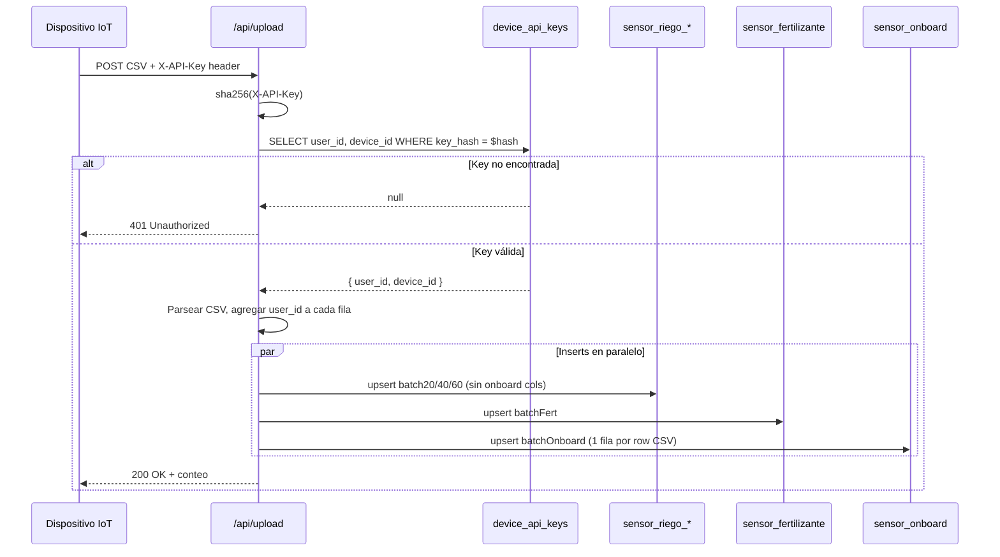
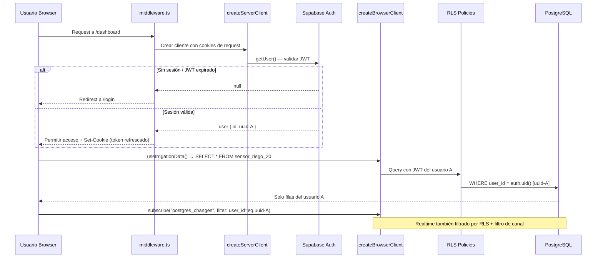

# Design: multi-tenant-sensor-isolation

## Decisiones Técnicas

### DT-1: Migración SQL única para todos los cambios de schema

**Contexto**: El cambio involucra modificaciones a 4 tablas existentes, creación de 6 tablas nuevas, eliminación de columnas, reemplazo de policies RLS, y creación de índices. Podría hacerse en múltiples migraciones incrementales o en una sola.

**Decisión**: Crear una única migración `002_multi_tenant.sql` que ejecute todos los cambios DDL en orden de dependencias: TRUNCATE de tablas existentes, creación de tablas nuevas, ALTER de tablas existentes (agregar user_id, eliminar columnas onboard), drop de policies antiguas, creación de policies nuevas, creación de índices. Todo dentro de una transacción implícita de Supabase.

**Justificación**: Al ser un proyecto en desarrollo/tesis sin datos de producción, una migración atómica evita estados intermedios inconsistentes. Si falla, se revierte completa. El orden de operaciones respeta las dependencias de FK (auth.users ya existe en Supabase).

**Alternativas descartadas**:
- Migraciones incrementales (002, 003, 004...): innecesariamente complejas para un proyecto sin datos legacy. Mayor riesgo de ejecutar parcialmente.
- Modificar 001_create_tables.sql directamente: rompe la trazabilidad de migraciones. Supabase CLI ya registró que 001 fue aplicada.

---

### DT-2: TRUNCATE previo a ALTER COLUMN para evitar violación NOT NULL

**Contexto**: Las tablas `sensor_riego_20`, `sensor_riego_40`, `sensor_riego_60` y `sensor_fertilizante` pueden tener filas existentes sin `user_id`. Agregar `user_id NOT NULL` fallaría.

**Decisión**: Ejecutar `TRUNCATE` en las 4 tablas de sensores y en `api_rate_limits` antes de agregar la columna `user_id`. Se usa `TRUNCATE ... CASCADE` para respetar cualquier FK futura.

**Justificación**: Proyecto de tesis sin datos irreemplazables. El TRUNCATE es la solución más simple y limpia, evitando defaults temporales o scripts de backfill.

**Alternativas descartadas**:
- DEFAULT con uuid fijo + backfill posterior: agrega complejidad innecesaria y deja datos con user_id ficticio.
- ALTER COLUMN ... SET DEFAULT gen_random_uuid(): genera user_ids que no corresponden a usuarios reales en auth.users, violando la FK.

---

### DT-3: Autenticación de API key via SHA-256 hash lookup en device_api_keys

**Contexto**: El endpoint `/api/upload` actualmente valida una API key estática (`SENSOR_API_KEY` en env). Para multi-tenant, necesita mapear cada key a un `user_id`. Hay dos opciones: timing-safe comparison contra cada key almacenada, o hash lookup directo.

**Decisión**: Calcular `sha256(X-API-Key)` en el backend con `createHash('sha256')` de Node.js, y hacer un lookup directo contra `device_api_keys.key_hash` con `supabaseAdmin`. Eliminar la validación estática con `timingSafeEqual` y la variable de entorno `SENSOR_API_KEY`.

**Justificación**: El hash lookup es O(1) via el PRIMARY KEY, mientras que timing-safe comparison contra múltiples keys sería O(n). SHA-256 es irreversible, protegiendo las keys en caso de breach de BD. El hash de la misma key siempre produce el mismo resultado, permitiendo lookup determinista.

**Alternativas descartadas**:
- Mantener SENSOR_API_KEY en env + campo user_id en env: no escala a múltiples dispositivos/usuarios.
- bcrypt en vez de SHA-256: bcrypt es para passwords con login interactivo. Las API keys son secretos de alta entropía que no necesitan salt ni factor de trabajo variable. SHA-256 es el estándar para API keys (ej: GitHub, Stripe).
- Timing-safe comparison con todas las keys de la BD: requiere cargar todas las keys en memoria y comparar una a una. No escala.

---

### DT-4: Patrón de clientes Supabase con @supabase/ssr

**Contexto**: Actualmente `client.ts` exporta un singleton `supabase` con `createClient` y `server.ts` exporta un singleton `supabaseAdmin` con service role. Para multi-tenant, el cliente browser necesita propagar cookies de sesión, y se necesita un cliente server con sesión para Server Components.

**Decisión**: Reestructurar en 3 exports:

1. `src/lib/supabase/client.ts` — exporta `createClient()` (función, no singleton) usando `createBrowserClient` de `@supabase/ssr`. En cada invocación `@supabase/ssr` reutiliza internamente la instancia (singleton bajo el capó), pero exponerlo como función es el patrón recomendado.

2. `src/lib/supabase/server.ts` — exporta:
   - `createClient()` — función async que crea cliente con sesión de usuario via `createServerClient` de `@supabase/ssr` + `cookies()` de `next/headers`. Para Server Components y API Routes que necesitan RLS.
   - `supabaseAdmin` — singleton con service role key (mismo patrón actual). Para operaciones privilegiadas como la ingesta.

3. `middleware.ts` — usa `createServerClient` de `@supabase/ssr` directamente con `request.cookies` y `response.cookies` (no puede usar `cookies()` de next/headers en middleware).

**Justificación**: Sigue el patrón oficial de Supabase para Next.js App Router. Separar el cliente con sesión del admin evita que accidentalmente se use service role donde debería haber RLS. El middleware necesita su propia instancia porque opera sobre request/response, no sobre el cookie store de server components.

**Alternativas descartadas**:
- Singleton para browser client: `createBrowserClient` ya maneja el singleton internamente, pero el patrón de función permite que el linter detecte imports incorrectos entre server/client.
- Un solo archivo `supabase.ts` con todo: mezcla responsabilidades server/client, dificulta tree-shaking, y es propenso a errores de importación cruzada.

---

### DT-5: Middleware Next.js con matcher explícito

**Contexto**: Necesitamos proteger las rutas del dashboard y refrescar la sesión, pero excluir `/api/upload` (autenticación propia vía API key) y assets estáticos.

**Decisión**: Crear `middleware.ts` en la raíz del proyecto con `config.matcher` que excluya rutas estáticas (`_next/static`, `_next/image`, `favicon.ico`, archivos con extensión) y `/api/upload`. El middleware usa `createServerClient` de `@supabase/ssr` para refrescar la sesión via `supabase.auth.getUser()`. Si no hay sesión activa y la ruta no es `/login` ni `/auth/*`, redirige a `/login`.

**Justificación**: El matcher explícito es más eficiente que una verificación condicional en el cuerpo del middleware. `getUser()` (no `getSession()`) es la forma segura de verificar la sesión porque valida el JWT contra Supabase Auth en vez de solo decodificar el token localmente.

**Alternativas descartadas**:
- No usar middleware y verificar sesión en cada page/layout: duplica lógica, es propenso a olvidar proteger una ruta.
- Middleware que procese TODAS las rutas con condicionales internos: menos eficiente, más código, mayor superficie de errores.

---

### DT-6: Realtime con filtro server-side vía RLS (sin filtro explícito en el canal)

**Contexto**: La spec `hooks-user-filter` requiere que las suscripciones Realtime incluyan `filter: 'user_id=eq.<uuid>'`. Sin embargo, Supabase Realtime ya respeta RLS desde que se usa un cliente con sesión.

**Decisión**: Usar doble protección: (1) RLS filtra automáticamente en el servidor via el JWT del `createBrowserClient`, y (2) agregar el filtro explícito `filter: 'user_id=eq.<uuid>'` en el canal Realtime. Para obtener el `user_id`, el hook llama a `supabase.auth.getUser()` al inicializarse.

**Justificación**: El filtro explícito en el canal es una optimización del servidor — reduce la carga de procesamiento de Realtime al filtrar antes de evaluar RLS. Además, cumple la spec tal como está escrita. Sin el filtro, RLS igual protegería, pero el servidor procesaría más eventos innecesariamente.

**Alternativas descartadas**:
- Solo RLS sin filtro en canal: funciona pero es menos eficiente en el servidor.
- Solo filtro en canal sin RLS: inseguro, el filtro de canal es una optimización, no una garantía de seguridad.

---

### DT-7: Separación de onboard data — una fila por batch de CSV, no por fila de sensor

**Contexto**: El CSV actual tiene las columnas `Onboard_Temp` y `Onboard_Hum` que se repiten idénticas en las 3 tablas de riego (20cm, 40cm, 60cm). Los datos onboard representan las condiciones del dispositivo IoT, no del suelo, y son las mismas para las 3 profundidades.

**Decisión**: Al procesar el CSV, insertar una sola fila en `sensor_onboard` por cada fila del CSV (no 3 filas repetidas). El `device_id` se obtiene del registro en `device_api_keys` (lookup ya realizado para resolver `user_id`). Los objetos de insert para `sensor_riego_*` ya no incluirán `temperatura_onboard` ni `humedad_onboard`.

**Justificación**: Normalización correcta — los datos onboard son una propiedad del dispositivo, no del sensor de profundidad. Insertar una sola fila por timestamp elimina la redundancia 3x actual. Además, las columnas se eliminan de las tablas de riego en la migración, así que no hay opción de seguir insertándolas ahí.

**Alternativas descartadas**:
- Una fila onboard por cada fila de sensor (3 filas idénticas por timestamp): desnormalizado, desperdicio de storage.
- No separar y mantener las columnas: contradice la spec `sensor-onboard-table` y mantiene datos conceptualmente distintos mezclados.

---

### DT-8: Constraint UNIQUE en sensor_riego con user_id compuesto

**Contexto**: Actualmente las tablas `sensor_riego_*` y `sensor_fertilizante` tienen `UNIQUE(timestamp)`. Con multi-tenant, dos usuarios diferentes podrían tener lecturas con el mismo timestamp. El constraint existente lo impediría.

**Decisión**: Reemplazar `UNIQUE(timestamp)` por `UNIQUE(user_id, timestamp)` en las 4 tablas de sensores existentes. El upsert en `/api/upload` cambiará `onConflict: "timestamp"` a `onConflict: "user_id,timestamp"`. La tabla `sensor_onboard` se crea directamente con `UNIQUE(user_id, created_at)`.

**Justificación**: En un esquema multi-tenant, el timestamp por sí solo no identifica unicidad — el par (user_id, timestamp) sí. Sin este cambio, el primer usuario que inserte un dato con timestamp T bloquearía a cualquier otro usuario con el mismo timestamp.

**Alternativas descartadas**:
- Mantener UNIQUE solo en timestamp: rompe multi-tenant. Solo el primer usuario podría insertar para cada timestamp.
- Eliminar el constraint UNIQUE: permitiría duplicados del mismo usuario, degradando la integridad de datos.
- Usar upsert con DO UPDATE: en este caso queremos ignorar duplicados del mismo usuario (ignoreDuplicates), no actualizarlos.

---

## Arquitectura

### Flujo de ingesta con resolución de user_id



### Flujo de autenticación y acceso a datos (browser)



### Modelo de datos post-migración

```mermaid
erDiagram
    AUTH_USERS {
        uuid id PK
    }

    DEVICE_API_KEYS {
        text key_hash PK
        uuid user_id FK
        text device_id
        timestamptz created_at
    }

    SENSOR_RIEGO_20 {
        bigint id PK
        uuid user_id FK
        timestamptz timestamp UK
        float8 temperatura_c
        float8 humedad
        float8 conductividad_us_cm
        float8 ph
        boolean es_evento_riego
        timestamptz created_at
    }

    SENSOR_RIEGO_40 {
        bigint id PK
        uuid user_id FK
        timestamptz timestamp UK
        float8 temperatura_c
        float8 humedad
        float8 conductividad_us_cm
        float8 ph
        boolean es_evento_riego
        timestamptz created_at
    }

    SENSOR_RIEGO_60 {
        bigint id PK
        uuid user_id FK
        timestamptz timestamp UK
        float8 temperatura_c
        float8 humedad
        float8 conductividad_us_cm
        float8 ph
        boolean es_evento_riego
        timestamptz created_at
    }

    SENSOR_FERTILIZANTE {
        bigint id PK
        uuid user_id FK
        timestamptz timestamp UK
        float8 nitrogen
        float8 phosphorus
        float8 potassium
        timestamptz created_at
    }

    SENSOR_ONBOARD {
        uuid id PK
        uuid user_id FK
        text device_id
        numeric temperatura
        numeric humedad
        timestamptz created_at UK
    }

    NOTIFICATIONS {
        uuid id PK
        uuid user_id FK
        text message
        boolean read
        timestamptz created_at
    }

    DECISIONES_RIEGO {
        uuid id PK
        uuid user_id FK
        text decision
        text razon
        jsonb sensor_data
        timestamptz created_at
    }

    CHAT_SESSIONS {
        uuid id PK
        uuid user_id FK
        text title
        timestamptz created_at
        timestamptz updated_at
    }

    DOCUMENTS {
        uuid id PK
        uuid user_id FK
        text name
        text content
        text type
        timestamptz created_at
    }

    AUTH_USERS ||--o{ DEVICE_API_KEYS : "posee"
    AUTH_USERS ||--o{ SENSOR_RIEGO_20 : "posee"
    AUTH_USERS ||--o{ SENSOR_RIEGO_40 : "posee"
    AUTH_USERS ||--o{ SENSOR_RIEGO_60 : "posee"
    AUTH_USERS ||--o{ SENSOR_FERTILIZANTE : "posee"
    AUTH_USERS ||--o{ SENSOR_ONBOARD : "posee"
    AUTH_USERS ||--o{ NOTIFICATIONS : "posee"
    AUTH_USERS ||--o{ DECISIONES_RIEGO : "posee"
    AUTH_USERS ||--o{ CHAT_SESSIONS : "posee"
    AUTH_USERS ||--o{ DOCUMENTS : "posee"
```



## Output Expected

### Archivos a crear

| Archivo | Descripción |
|---------|-------------|
| `supabase/migrations/002_multi_tenant.sql` | Migración SQL completa: TRUNCATE tablas existentes, agregar user_id NOT NULL a 4 tablas sensor, eliminar columnas onboard de 3 tablas riego, reemplazar UNIQUE(timestamp) por UNIQUE(user_id, timestamp), crear 6 tablas nuevas (device_api_keys, sensor_onboard, notifications, decisiones_riego, chat_sessions, documents), drop policies USING(true), crear policies auth.uid()=user_id (SELECT+INSERT) + service role INSERT en todas las tablas, crear índices sobre user_id, agregar sensor_onboard al Realtime publication |
| `middleware.ts` | Middleware Next.js: crea cliente Supabase con cookies de request/response, llama getUser() para refrescar sesión, redirige a /login si no hay sesión activa. Matcher excluye /api/upload, /login, /auth/*, _next/*, archivos estáticos |

### Archivos a modificar

| Archivo | Cambio |
|---------|--------|
| `package.json` | Agregar dependencia `@supabase/ssr` |
| `src/lib/supabase/client.ts` | Reemplazar `createClient` de `@supabase/supabase-js` por `createBrowserClient` de `@supabase/ssr`. Cambiar de singleton a función `createClient()` que retorna la instancia browser |
| `src/lib/supabase/server.ts` | Agregar función `createClient()` async que usa `createServerClient` de `@supabase/ssr` con `cookies()` de next/headers. Mantener `supabaseAdmin` singleton con service role |
| `src/app/api/upload/route.ts` | (1) Reemplazar validación estática de API key por sha256 hash lookup en device_api_keys. (2) Resolver user_id y device_id del lookup. (3) Agregar user_id a todos los batch objects (batch20, batch40, batch60, batchFert). (4) Eliminar campos temperatura_onboard/humedad_onboard de batch20/40/60. (5) Crear batchOnboard y hacer insert en sensor_onboard. (6) Cambiar onConflict de "timestamp" a "user_id,timestamp". (7) Eliminar variable SENSOR_API_KEY. (8) Queries de last humidity deben filtrar por user_id |
| `src/hooks/use-irrigation-data.ts` | (1) Importar createClient de nuevo client.ts. (2) Obtener user via supabase.auth.getUser(). (3) Si no hay user, retornar vacío sin suscribir. (4) Agregar filtro Realtime `filter: 'user_id=eq.<uuid>'` a los 3 canales. (5) RLS filtra queries automáticamente |
| `src/hooks/use-fertilizer-data.ts` | Mismos cambios que use-irrigation-data: import de nuevo client, verificar auth, filtro Realtime |
| `src/types/index.ts` | (1) Agregar `user_id: string` a SensorRiego y SensorFertilizante. (2) Eliminar `temperatura_onboard` y `humedad_onboard` de SensorRiego. (3) Agregar tipo SensorOnboard con campos id, user_id, device_id, temperatura, humedad, created_at. (4) Agregar tipos para las tablas nuevas: Notification, DecisionRiego, ChatSession, Document |

## Contratos de Componentes

### Tipos TypeScript actualizados

```typescript
// src/types/index.ts

export interface SensorRiego {
  id: number
  user_id: string
  timestamp: string
  temperatura_c: number
  humedad: number
  conductividad_us_cm: number
  ph: number
  es_evento_riego: boolean
}

export interface SensorFertilizante {
  id: number
  user_id: string
  timestamp: string
  nitrogen: number
  phosphorus: number
  potassium: number
}

export interface SensorOnboard {
  id: string
  user_id: string
  device_id: string | null
  temperatura: number | null
  humedad: number | null
  created_at: string
}

export interface Notification {
  id: string
  user_id: string
  message: string
  read: boolean
  created_at: string
}

export interface DecisionRiego {
  id: string
  user_id: string
  decision: string
  razon: string | null
  sensor_data: Record<string, unknown> | null
  created_at: string
}

export interface ChatSession {
  id: string
  user_id: string
  title: string | null
  created_at: string
  updated_at: string
}

export interface UserDocument {
  id: string
  user_id: string
  name: string
  content: string | null
  type: string | null
  created_at: string
}
```

### Cliente Supabase — contratos de export

```typescript
// src/lib/supabase/client.ts
export function createClient(): SupabaseClient

// src/lib/supabase/server.ts
export async function createClient(): Promise<SupabaseClient>
export const supabaseAdmin: SupabaseClient
```

### API Upload — nuevo flujo de resolución

```typescript
// Pseudocódigo del flujo en /api/upload
const apiKey = request.headers.get("X-API-Key")
if (!apiKey) return 401

const keyHash = createHash('sha256').update(apiKey).digest('hex')
const { data } = await supabaseAdmin
  .from('device_api_keys')
  .select('user_id, device_id')
  .eq('key_hash', keyHash)
  .single()

if (!data) return 401
const { user_id, device_id } = data

// Todos los inserts incluyen user_id
// Onboard data va a sensor_onboard con device_id
```

## Estrategia de Testing

Dado que el proyecto no tiene tests automatizados y están fuera de scope de este cambio, la verificación se hará en la fase `sdd-verify` mediante:

1. **Verificación de schema**: Ejecutar `\d` en cada tabla modificada/creada para confirmar columnas, constraints, y FK.
2. **Verificación de RLS**: Con dos usuarios de test, verificar que SELECT de cada tabla retorna solo filas propias.
3. **Verificación de ingesta**: Enviar CSV con API key registrada en device_api_keys, verificar que los inserts incluyen user_id correcto y onboard va a sensor_onboard.
4. **Verificación de middleware**: Acceder a ruta protegida sin sesión y verificar redirección a /login. Acceder con sesión y verificar acceso.
5. **Verificación de Realtime**: Con usuario autenticado, verificar que suscripción recibe solo eventos propios.
6. **Compilación TypeScript**: `npx tsc --noEmit` sin errores.

## Orden de Implementación Recomendado

El orden de implementación respeta las dependencias entre specs:

1. **Fase DB** (specs: user-id-column-sensors, device-api-keys-table, new-tables-schema, sensor-onboard-table, rls-policies-sensors):
   - `supabase/migrations/002_multi_tenant.sql` — toda la migración SQL en un archivo

2. **Fase Deps + Auth infra** (specs: ssr-supabase-client):
   - `package.json` — agregar @supabase/ssr
   - `src/lib/supabase/client.ts` — createBrowserClient
   - `src/lib/supabase/server.ts` — createServerClient + mantener supabaseAdmin

3. **Fase Middleware** (spec: middleware-auth):
   - `middleware.ts` — protección de rutas + refresh de sesión

4. **Fase Ingesta** (specs: api-upload-user-resolution, api-upload-onboard-write):
   - `src/app/api/upload/route.ts` — hash lookup + user_id en inserts + onboard separado

5. **Fase Tipos** (specs: frontend-onboard-query, hooks-user-filter):
   - `src/types/index.ts` — actualizar tipos

6. **Fase Hooks** (specs: hooks-user-filter, frontend-onboard-query):
   - `src/hooks/use-irrigation-data.ts` — auth + filtro Realtime
   - `src/hooks/use-fertilizer-data.ts` — auth + filtro Realtime
